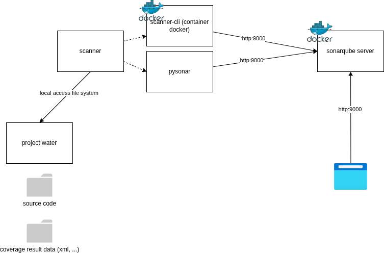

# Analyses



## Démarrage du serveur SonarQube

Via un conteneur docker en mode standalone en suivant la documentation et les prérequis.

```bash
docker run --name sonarqube-test -d -p 9000:9000 sonarqube:latest
```

Attendre que le message `SonarQube is operational` dans les logs

```bash
docker logs sonarqube-test
```

## Déclencher une analyse statique

Créer le projet dans SonarQube et enregister le nom dans le fichier de configuration `sonar-project.properties`

```properties
sonar.projectKey=webapp
```

Créer un token d'accès à SonarQube.

### SonarScanner CLI

Créer un sous-réseau docker

```bash
docker network create sonar_network
```

Rattacher le conteneur sonarqube en lui associant un alias réseau

```bash
docker network connect sonar_network sonarqube-test --alias sonarqube
```

Déclencher l'analyse statique et soumettre le résultat au serveur SonarQube.

```bash
YOUR_REPO="."
SONARQUBE_URL="sonarqube:9000"
SONAR_TOKEN="sqp_b317940c89400cfd9b964da1a60097e4567e1d40"
docker run --rm -e SONAR_HOST_URL="http://${SONARQUBE_URL}" -e SONAR_TOKEN=$SONAR_TOKEN --network sonar_network -v "${YOUR_REPO}:/usr/src" sonarsource/sonar-scanner-cli
```

Réaliser un équivalent avec compose

```yaml
services:
    sonarqube:
        image: sonarqube:latest
        ports:
            - "9000:9000"
    cli:
        image: sonarsource/sonar-scanner-cli
        environment:
            - SONAR_HOST_URL=http://sonarqube:9000
            - SONAR_TOKEN=sqp_1f6ade3ee9215a1ec43f95794f20a79c256cd68e
        volumes:
            - "/home/gael/Projects/argonaultes/2025-2026/correction-evaluation-deve846/:/usr/src"

```

### SonarScanner for Python

TODO

## Déclencher une analyse dynamique

Transformer le projet en projet UV

```bash
uv init --bare .
```

Une fois le projet uv appliqué, installer les modules nécessaires

```bash
uv add flask
```

```bash
uv add pytest --dev
```

Ajouter le module pytest-cov

```bash
uv add pytest-cov --dev
```

Exécuter les tests en activante la production du rapport de couverture de test

```bash
uv run pytest --cov . --cov-report xml
```

Convertir le fichier sqlite `.coverage` en fichier xml


```bash
uv run coverage xml
```

Configurer l'emplacement du fichier de couverture de code dans le fichier `sonar-projet.properties` comme indiqué dans la [documentation](https://docs.sonarsource.com/sonarqube-server/2025.1/analyzing-source-code/test-coverage/python-test-coverage).

```properties
sonar.python.coverage.reportPaths=coverage.xml
```

Elements à corriger

~~Rendre plus robuste l'exécution des tests : ne pas être perturbé par la présence éventuelle d'un fichier de configuration/data `water.json`~~

~~La duplication du code de test nuit à la maintenabilité, il faut réduire et mutualiser les fonctions de test, en utilisant notamment les paramètres de test~~

Aligner la réponse de la route `check_alert` avec les autres réponses.

~~Séparer le code spécifique aux controleurs (partie interface flask) du code spécifiques aux classes de Service~~

~~Séparer en conséquence les tests.~~